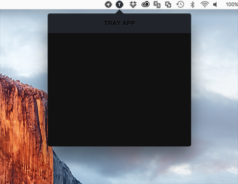
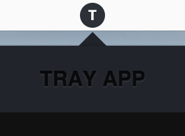

# electron-trayapp(Arrow trick)

This is a Arrow trick for Electron tray application.
**tested on only mac os**

**Mac OS**





```bash
# Clone this repository
$ git clone https://github.com/gilhyun/electron-trayapp
# Go into the repository
$ cd electron-trayapp
# Install dependencies and run the app
$ npm install && npm start
```
